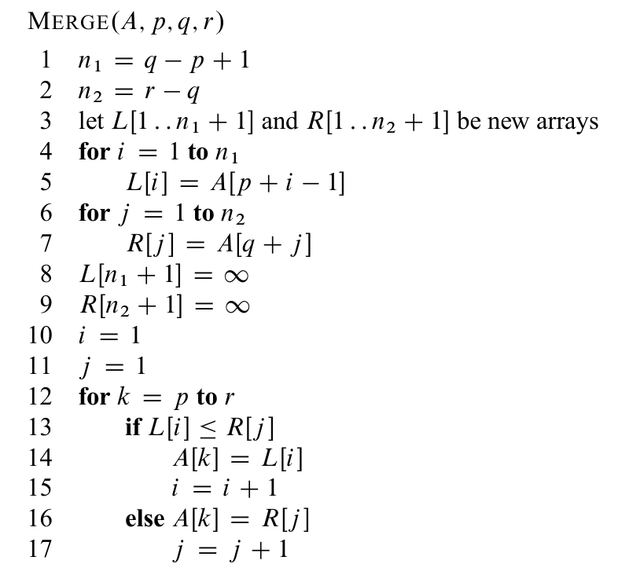

merge sort
==========

Notes
-----
* divide-and-conquer approach
    * divide the input sequence into two halves
    * sort subsequences recursively using merge sort
    * merge two sorted subsequences into sorted answer

Pseudocode
----------

